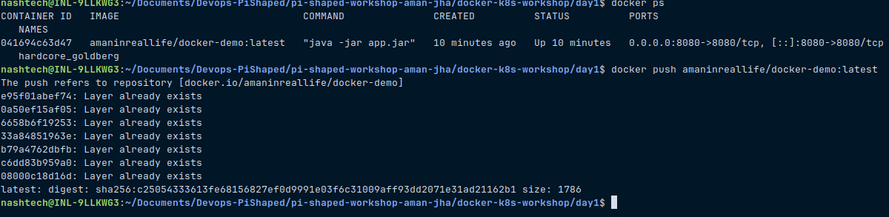

# Pi-Shaped-Workshop-Aman Jha

## Core Concept Questions

### 1. Why is Docker useful in building and deploying microservices for a real-world product (like an e-commerce or banking app)?

Docker acts like a smart delivery box that wraps up each microservice with its own tools, settings, and environment. This makes the whole system:
- **Environment-independent** – it runs the same on a developer’s laptop or on a production server.
- **Fast to deploy or revert** – each service is packed into an image you can version and roll back anytime.
- **Easy to manage** – no more dependency clashes; everything needed is inside the container.
- **Individually scalable** – need more power for search but not for payments? Just scale that one container.

---

### 2. What is the difference between a Docker image and a container in the context of scaling a web application?

- **Docker Image**: A blueprint or template that contains everything needed to run the application (code, libraries, config).
- **Docker Container**: A running instance of an image.

In scaling:
- We **create multiple containers** from the same image to handle more load.
- This ensures uniformity and faster boot times during auto-scaling.

---
### 3. How does Kubernetes complement Docker when running a product at scale (e.g., hundreds of containers)?

Docker is great for packaging and running a single container, but when you have tons of containers running — like in a real-world app — it gets tricky to manage.

That’s where **Kubernetes** steps in. It’s like a smart manager that:
- Takes care of starting, stopping, and restarting containers automatically.
- Scales them up or down based on traffic or load.
- Keeps everything running smoothly with features like self-healing, service discovery, and rolling updates.
- Spreads containers across nodes efficiently, so resources are used better and apps stay online.

Basically, Kubernetes makes sure your Docker containers don’t just run — they run *well* at scale.
---

## Submission Checklist

- Dockerfile — Present inside `docker-k8s-workshop/day1/docker-demo/`
- Source code (e.g., `app.jar`, `DockerDemoApplication.java`) — Inside `docker-demo/`
- Screenshot or log of Docker image being pushed — Included in logs (see below)
- 
- Link to Docker Hub image: [https://hub.docker.com/r/amaninreallife/docker-demo](https://hub.docker.com/r/amaninreallife/docker-demo)

**Sample Push Log:**
```text
docker push amaninreallife/docker-demo:latest
The push refers to repository [docker.io/amaninreallife/docker-demo]
e95f01abef74: Pushed 
...
0.0.1: digest: sha256:c25054333613fe68156827ef0d9991e03f6c31009aff93dd2071e31ad21162b1 size: 1786
