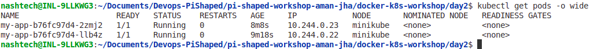
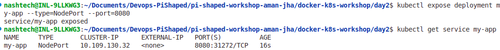

# Pi-Shaped-Workshop-Aman Jha

## Core Concept Questions

**1. Why do we set requests and limits for CPU and memory in a production-grade product?**

Setting resource requests and limits helps Kubernetes efficiently allocate cluster resources and ensures application stability. Requests specify the minimum resources a pod needs, aiding the scheduler in placing pods on nodes that can satisfy those requirements. Limits prevent pods from over-consuming resources, protecting the cluster from potential resource starvation and enabling fair resource sharing among workloads. This balance is critical for predictable performance, cost control, and preventing noisy neighbor issues in production environments.

**2. When would a product team apply node affinity in Kubernetes?**

Node affinity is used when workloads require scheduling on specific nodes based on node attributes, such as hardware capabilities, geographic location, or compliance needs. For example, teams might use node affinity to ensure that latency-sensitive applications run on high-performance nodes, or that data-sensitive pods are placed in nodes within specific regulatory zones. It helps optimize resource utilization, enhance performance, and maintain policy compliance.

---

## Affinity Rules Explanation

In this deployment, node affinity rules are applied to strictly schedule pods on nodes labeled with the hostname `minikube`. The configuration uses `requiredDuringSchedulingIgnoredDuringExecution`, which enforces mandatory pod placement only on the targeted node.

The deployment also includes tolerations allowing pods to remain scheduled on nodes that may temporarily become `NotReady` or `Unreachable`, with a toleration timeout of 300 seconds. This ensures pods are not immediately evicted during transient node failures, increasing application resilience.

These affinity and toleration settings enable fine-grained control over pod placement and availability, essential for real-world Kubernetes cluster management where resource optimization and fault tolerance are paramount.

---

## Screenshot / Logs

*Add screenshots or terminal logs here showing pods running and the node they are scheduled on using `kubectl get pods -o wide`.*

*expose my day1 app to 8080.*

*on browser result: [http://192.168.49.2:31272/hello](http://192.168.49.2:31272/hello)*
