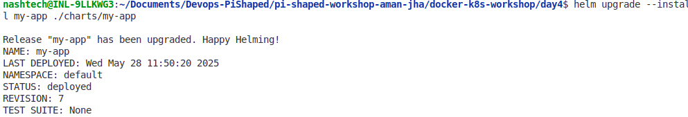
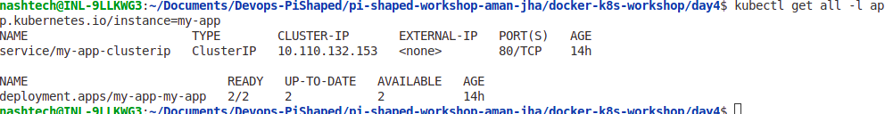
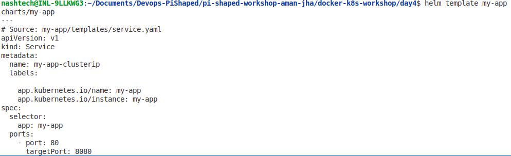
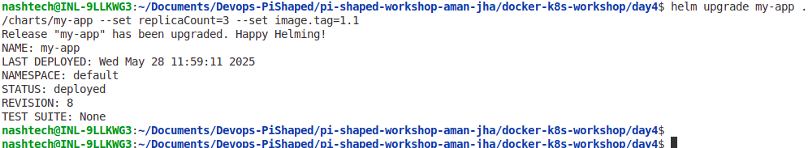
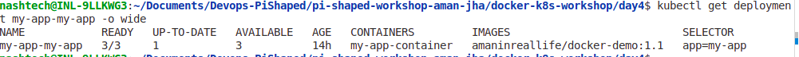
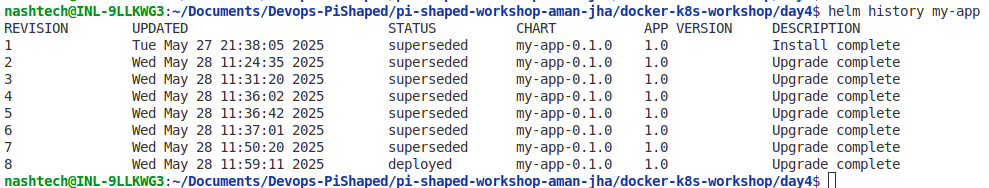

# Day 4 Exercise: Aman Jha - Helm Charts and Custom Helm Templates

## Objective
Demonstrate the ability to package an application using Helm and implement configuration options using `values.yaml` for flexible and reusable deployments.

---

## Tasks Completed

1. **Created a Helm chart** from existing Kubernetes manifests under `charts/my-app/`.
2. **Parameterized the Helm chart** using `values.yaml` to make the following configurable:
   - Image repository and tag
   - Container port
   - Replica count
   - Resource requests and limits
   - Node affinity and tolerations
   - Ingress configuration
3. **Packaged and installed the Helm chart** using the command:

   ```bash
   helm upgrade --install my-app ./charts/my-app

4. **Upgraded the deployment** via Helm to change the replica count or image tag, e.g.:

    ```bash
    helm upgrade --install my-app ./charts/my-app --set replicaCount=4 --set image.tag=v2.1

## How to Install and Upgrade

1. **Install the Helm Chart**

    ```bash
    helm upgrade --install my-app ./charts/my-app

2. **Verify Deployment**

    ```bash
    kubectl get deployment my-app-my-app
    kubectl get pods
    kubectl describe deployment my-app-my-app

## Core Concept Questions

### 1. Why is Helm essential for managing configurations across multiple environments like development, staging, and production?

In real-world scenarios, each environment often requires slight differences in configurations—such as replica counts, resource limits, or service URLs. Helm streamlines this complexity by allowing you to define a single chart template and override environment-specific values through separate `values.yaml` files or command-line parameters. This approach reduces human error, promotes consistency, and accelerates deployment workflows by avoiding the need to maintain multiple sets of nearly identical YAML manifests.

**Use Case 1:**  
Consider an e-commerce application that runs in both staging and production. The staging environment might use smaller resource limits and fewer replicas, while production requires high availability and autoscaling. Helm lets you manage these variations easily without duplicating manifests, ensuring deployments stay synchronized and easier to maintain.

---

### 2. How does Helm improve incident response by simplifying deployment rollback?

Helm versions each deployment as a "release" and keeps a history of these releases. If a newly deployed version introduces bugs or performance regressions, operators can use Helm's rollback feature to revert to a previous stable release with a single command. This drastically cuts down the time spent troubleshooting and reduces service downtime, enabling teams to maintain reliability and user trust.

**Use Case 2:**  
During a product update, a new microservice version causes unexpected crashes. Instead of manually modifying Kubernetes objects or redeploying old manifests, the team uses `helm rollback` to instantly restore the last working release, buying time to fix the issue without impacting users.

## Screenshots of All Operations I did:

1. **Helm Install Command Output:

    - Screenshot of running and successfully installing my Chart:
    ```bash
    helm upgrade --install my-app ./charts/my-app
    ```

    

2. **Kubectl Get All Resources Labeled**:

    ```bash
    kubectl get all -l app.kubernetes.io/instance=my-app
    ```

    

3. **Helm Templates**:

    

4. **Helm Upgrade Command Output**

    ```bash
    helm upgrade my-app ./charts/my-app --set replicaCount=3 --set image.tag=1.1
    ```

    

5. **Kubectl Get Deployment Showing Updated Replicas or Image**:

    ```bash
    kubectl get deployment my-app-my-app -o wide
    ```

    

6. **Helm History**

    ```bash
    helm history my-app
    ```

    


