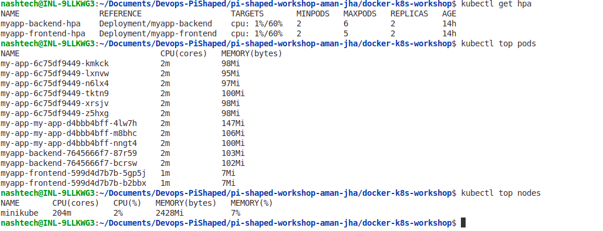

# Day 5: Aman Jha - Kubernetes Performance Tuning & Cost Optimization

## Tasks Completed

1. **Created a 2-tier Application**  
   - Frontend and backend deployed using helm manifests with appropriate resource requests and limits.  
2. **Implemented Probes**  
   - Added liveness and readiness probes to ensure pod health and readiness before receiving traffic.  
3. **Configured Horizontal Pod Autoscaler (HPA)**  
   - Autoscaling based on CPU usage to handle variable workloads efficiently.  
4. **Added Comments in Manifests**  
   - Documented performance tuning and cost optimization considerations inline.

---

## Optimization Strategies Used

- **Resource Requests & Limits:**  
  Defined CPU and memory requests to guarantee minimum resources and limits to prevent noisy neighbor effects, ensuring stable performance and avoiding over-provisioning costs.

- **Probes (Liveness & Readiness):**  
  Implemented to maintain reliability by restarting unhealthy pods and controlling traffic flow only to healthy pods, reducing downtime and user-facing errors.

- **Horizontal Pod Autoscaler (HPA):**  
  Automatically scales pods out during peak loads (e.g., flash sales) and scales in during low usage periods, balancing user experience and infrastructure costs.

- **Efficient Image Usage:**  
  Used minimal base images and multi-stage builds to reduce container image size, speeding up startup times and lowering storage costs.

---

## URL Paths and Expected Responses

| URL Path              | Service Type        | Expected Response                         |
|-----------------------|---------------------|-------------------------------------------|
| `http://<NodeIP>:30080` | NodePort            | Access to frontend landing or root endpoint    |
| `http://<MinikubeIP>/myapp`  | Ingress (path-based) | Routes to frontend app, handles requests correctly |
| `http://<MinikubeIP>/myapp/api`  | Backend API endpoint | Routes to backend API services |

---

## Core Concepts

### 1. Why are liveness and readiness probes critical in keeping a product’s user experience stable and reliable?  
Liveness probes detect and restart pods that are stuck or unhealthy, preventing service degradation. Readiness probes ensure only healthy pods receive traffic, avoiding errors and downtime during deployments or pod restarts.

**Real-world use case:**  
In a payment processing service for an e-commerce platform, if a backend pod becomes unresponsive due to a deadlock or memory leak, the liveness probe will detect it and restart the pod automatically, avoiding prolonged service outages. Meanwhile, readiness probes prevent traffic from routing to pods still initializing or temporarily unhealthy, ensuring customers never face errors during checkout.

### 2. How does Horizontal Pod Autoscaler (HPA) help in handling flash sales, seasonal load spikes, or traffic surges in real-world applications like an e-commerce platform?  
HPA dynamically adjusts the number of pods based on resource usage, allowing the app to scale out during high demand and scale in when demand drops, ensuring availability and cost efficiency.

**Real-world use case:**  
During Black Friday flash sales, the frontend and backend services experience sudden spikes in traffic. HPA scales out the number of pods based on CPU or memory consumption, maintaining fast response times and uptime. When traffic returns to normal post-sale, HPA scales the pods back down to reduce cloud infrastructure costs.

---

## Screenshots

1. **Scaling Event Screenshot**  

